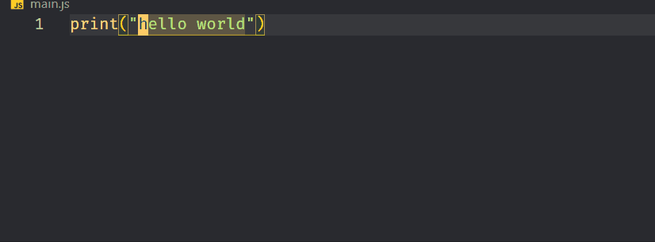
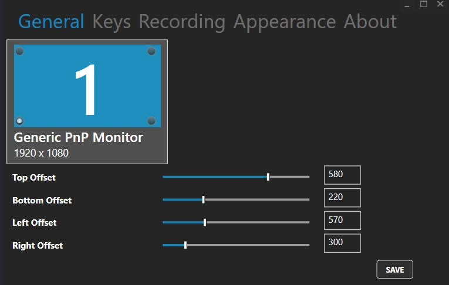

- [VIM](#vim)
	- [Vim Configuration](#vim-configuration)
		- [Linux](#linux)
		- [VsCode](#vscode)
		- [IntelliJ IDEA](#intellij-idea)
		- [KeyStroke](#keystroke)

# VIM

- All Using Keyboard Only: 👇

<div align="center">

</div>

`Vi` is an ancient text editor, old even before the first age of the world. It was designed to work on contraptions called terminals with the very uncommon yet inspired characteristic of functioning in a modal fashion. That is, it has a mode for inserting text, another for editing text, a different one for selecting text, and so on.

Vi’s latest and most celebrated incarnation is `Vim` (Vi `IMproved` and formerly Vi IMitation) which works both with text and graphical interfaces, comes with a plethora of improvements over vi and is supported on every platform known to humankind. But the impact of Vim doesn’t stop with Vim, Vim’s ideas are so very remarkable that they’ve trascended the Vim editor itself and propagated into other editors. Today you can find Vim-like modes in almost any editor and IDE that you can imagine. Like in Visual Studio Code.

- **Resources:**
  - [Boost Your Coding Fu With Visual Studio Code and Vim](https://www.barbarianmeetscoding.com/blog/boost-your-coding-fu-with-vscode-and-vim)
  - [Vim Cheat Sheet](https://vim.rtorr.com/)
  - [VIM & Visual Studio Code Tips & Tricks](https://dev.to/muhajirdev/vim-visual-studio-code-tips-tricks-with-video-gif-8on?signin=true)

## Vim Configuration

### Linux

Create Or Modify `.vimrc` File

- Go to Root directory

```bash
cd ~
ls -a
vi .vimrc
```

- Put these lines:

```bash
syntax on
set number
set clipboard=unnamed
```

- Save and Exit:
  - Press `<ESC>` or `<CTRL-C>` or `ctrl+space` to Enter into `normal` mode
  - then type `:wq` to save and exit

### VsCode

```json
 "vim.useCtrlKeys": true,
 "vim.useSystemClipboard": true,
 // Insert mode
 "vim.insertModeKeyBindings": [
  // In insert mode jj to escape
  {
   "before": ["j", "j"],
   "after": ["<Esc>"]
  },
  {
   "before": ["a", "a"],
   "after": ["<Esc>"]
  }
 ],
 // Visual mode
 "vim.visualModeKeyBindings": [
  // In visual mode i goes to insert mode
  {
   "before": ["i"],
   "after": ["<Esc>", "i"]
  },
  // In visual mode i goes to insert mode
  {
   "before": ["a"],
   "after": ["<Esc>", "a"]
  }
 ],
 // *** Escaping *** from vim for below commands
 "vim.handleKeys": {
  // Select all
  "<C-a>": false,
  // VS Code search in file
  "<C-f>": false,
  // VS Code new marker @ next occurence
  "<C-d>": false,
  // Copy
  "<C-c>": false,
  // Cut
  "<C-x>": false,
  // Paste
  "<C-v>": false
 },
 "vim.sneak": true,
 "vim.easymotion": true,

```

### IntelliJ IDEA

`C:\Users\u-name\.ideavimrc`

```bash
imap jj <Esc>
imap aa <Esc>
```

### KeyStroke

- [Carnac](http://code52.org/carnac/)

<div align="center">

</div>
