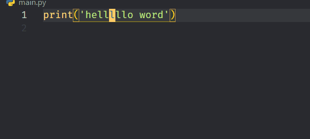
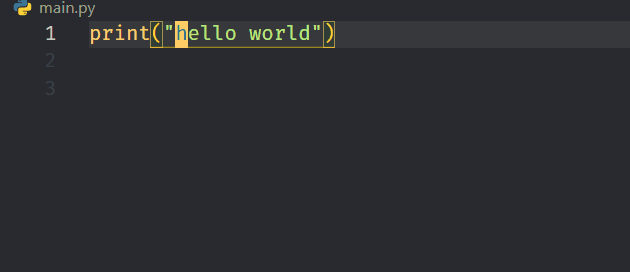

- [VIM](#vim)
  - [Vim Configuration](#vim-configuration)
    - [Linux](#linux)
    - [VsCode](#vscode)
    - [IntelliJ IDEA](#intellij-idea)
    - [KeyStroke](#keystroke)
  - [Vim Fundamentals](#vim-fundamentals)
    - [Syntax: `Verb + Noun`](#syntax-verb--noun)
    - [Verbs in Vim](#verbs-in-vim)
    - [Nouns in Vim -- Motions](#nouns-in-vim----motions)
    - [Nouns in Vim -- Text Objects](#nouns-in-vim----text-objects)
    - [Nouns in Vim -- Parameterized Text Objects](#nouns-in-vim----parameterized-text-objects)
  - [Navigation With Vim Motions](#navigation-with-vim-motions)
    - [Character By Character](#character-by-character)
    - [Move Horizontally Word By Word](#move-horizontally-word-by-word)
    - [Move to A Specific Character](#move-to-a-specific-character)
    - [Move Horizontally Extremely](#move-horizontally-extremely)
    - [To Move Vertically](#to-move-vertically)
    - [Vertical Motions With Search Pattern](#vertical-motions-with-search-pattern)
    - [Moving Faster With Counts](#moving-faster-with-counts)
    - [Moving Semantically](#moving-semantically)
    - [Document](#document)
    - [Window](#window)
  - [Editing With Vim Operators](#editing-with-vim-operators)
    - [`dnj` deletes n lines down](#dnj-deletes-n-lines-down)
    - [`df{character}` and `df{character}` deletes everything until the first occurrence of the character](#dfcharacter-and-dfcharacter-deletes-everything-until-the-first-occurrence-of-the-character)
    - [`d/{pattern}` deletes everything until the first occurrence of `pattern`](#dpattern-deletes-everything-until-the-first-occurrence-of-pattern)
    - [Editing Up a Notch With Text Objects](#editing-up-a-notch-with-text-objects)
      - [`daw` or `dw` to delete a word (plus trailing whitespace)](#daw-or-dw-to-delete-a-word-plus-trailing-whitespace)
      - [`ciw` and `cw` to change inner word](#ciw-and-cw-to-change-inner-word)
      - [`di"` to delete something in double quotes (`da"`including the quotes)](#di-to-delete-something-in-double-quotes-daincluding-the-quotes)
      - [`das` to delete a sentence (`dis` delete inner sentence)](#das-to-delete-a-sentence-dis-delete-inner-sentence)
      - [`dab`, `da(` or `da)` to delete a block surrounded by `(`](#dab-da-or-da-to-delete-a-block-surrounded-by-)
      - [`daB` `da{` or `da}` to delete a block surrounded by `{`](#dab-da-or-da-to-delete-a-block-surrounded-by--1)
      - [`dat` to delete an HTML tag (`cat` go to insert mode)](#dat-to-delete-an-html-tag-cat-go-to-insert-mode)
      - [`dit` to change the contents of an HTML tag (`cit` go to insert mode)](#dit-to-change-the-contents-of-an-html-tag-cit-go-to-insert-mode)
      - [`dap` to delete a paragraph](#dap-to-delete-a-paragraph)
    - [Surrounding Things With Vim Surround](#surrounding-things-with-vim-surround)
    - [Miscellaneous](#miscellaneous)

# VIM

- All Using Keyboard Only (without mouse): 👇

<div align="center">

</div>

`Vi` is an ancient text editor, old even before the first age of the world. It was designed to work on contraptions called terminals with the very uncommon yet inspired characteristic of functioning in a modal fashion. That is, it has a mode for inserting text, another for editing text, a different one for selecting text, and so on.

Vi’s latest and most celebrated incarnation is `Vim` (Vi `IMproved` and formerly Vi IMitation) which works both with text and graphical interfaces, comes with a plethora of improvements over vi and is supported on every platform known to humankind. But the impact of Vim doesn’t stop with Vim, Vim’s ideas are so very remarkable that they’ve trascended the Vim editor itself and propagated into other editors. Today you can find Vim-like modes in almost any editor and IDE that you can imagine. Like in Visual Studio Code.

- **Resources:**
  - [Boost Your Coding Fu With Visual Studio Code and Vim](https://www.barbarianmeetscoding.com/blog/boost-your-coding-fu-with-vscode-and-vim)
  - [MOVING EVEN FASTER WITH VIM SURROUND AND EASYMOTION](https://www.barbarianmeetscoding.com/boost-your-coding-fu-with-vscode-and-vim/moving-even-faster-with-vim-sneak-and-easymotion/)
  - [Vim Cheat Sheet](https://vim.rtorr.com/)
  - [VIM & Visual Studio Code Tips & Tricks](https://dev.to/muhajirdev/vim-visual-studio-code-tips-tricks-with-video-gif-8on?signin=true)
  - [Vim Hop/EasyMotion: The Power of Single-Char, Multi-Line Motion](https://medium.com/codex/vim-for-the-win-the-power-of-single-char-motion-82d93b4bf6d6)

## Vim Configuration

### Linux

Create Or Modify `.vimrc` File

- Go to Root directory

```bash
cd ~
ls -a
vi .vimrc
```

- Put these lines:

```bash
syntax on
set number
set clipboard=unnamed
```

- Save and Exit:
  - Press `<ESC>` or `<CTRL-C>` or `ctrl+space` to Enter into `normal` mode
  - then type `:wq` to save and exit

### VsCode

```json
 "vim.useCtrlKeys": true,
 "vim.useSystemClipboard": true,
 // Insert mode
 "vim.insertModeKeyBindings": [
  // In insert mode jj to escape
  {
   "before": ["j", "j"],
   "after": ["<Esc>"]
  },
  {
   "before": ["a", "a"],
   "after": ["<Esc>"]
  }
 ],
 // Visual mode
 "vim.visualModeKeyBindings": [
  // In visual mode i goes to insert mode
  {
   "before": ["i"],
   "after": ["<Esc>", "i"]
  },
  // In visual mode i goes to insert mode
  {
   "before": ["a"],
   "after": ["<Esc>", "a"]
  }
 ],
 // *** Escaping *** from vim for below commands
 "vim.handleKeys": {
  // Select all
  "<C-a>": false,
  // VS Code search in file
  "<C-f>": false,
  // VS Code new marker @ next occurence
  "<C-d>": false,
  // Copy
  "<C-c>": false,
  // Cut
  "<C-x>": false,
  // Paste
  "<C-v>": false
 },
 "vim.sneak": true,
 "vim.easymotion": true,

```

### IntelliJ IDEA

`C:\Users\u-name\.ideavimrc`

```bash
imap jj <Esc>
imap aa <Esc>
```

### KeyStroke

- [Carnac](http://code52.org/carnac/)

<div align="center">

</div>

## Vim Fundamentals

- Go into `Insert` mode with `i` where you can type stuff as usual
- Go back to `Normal` mode with `<ESC>` or `<CTRL-C>`
- Go into `Visual` mode with `v` (Must be in Normal mode to going into Visual Mode)

### Syntax: `Verb + Noun`

- `d` for **delete**
- `w` for **word**,

so, `dw` combined to be **"delete word"**

<div align="center">

</div>

### Verbs in Vim

The operation you want to take on the text

- `d`  : Delete
- `c` : Change (It **deletes** and sends you into **insert** mode so that you can type)
- `>`  : Indent (`.`for repeating last command)

<div align="center">

</div>

- `y`  : Yank (copy)
- `p`  : Paste
- `v`  : Visually select

### Nouns in Vim -- Motions

- `wW` : word (forward by a "word" | cursor at the beginning of the word )
- `eE` : word (forward by a "word" | cursor at the end of the  word)
- `bB` : back (back by a "word")
- `2j` : down 2 lines

other > `wWbBeE `

### Nouns in Vim -- Text Objects

The way that you specify a text object within a command is
**by combining**

- the letter `a` (which represents the text object plus whitespace) or
- `i` (inner object without whitespace)

**with a character that represents a text object itself:**

- `w` for word
- `s` for sentence
- `' "` for quotes
- `p` for paragraph
- `b` for block surrounded by `(`
- `B` for block surrounded by `{`
- `t` for tag

So,

- `iw` : "inner word" (works from anywhere in a word)
- `it` : "inner tag" (the contents of an HTML tag)
- `i"` : "inner quotes"
- `ip` : "inner paragraph"
- `as` : "a sentence"

i.e. to delete different bits of text you could:

`di”`   -> **Delete inside Quotes**.

<div align="center">

</div>

### Nouns in Vim -- Parameterized Text Objects

- `f, F` : "<f>			</f>ind" the next character
- `t, T` : "find" the next character
- `/` : Search (up to the next match)

<div align="center">

</div>

## Navigation With Vim Motions

<div align="center">

</div>

### Character By Character

- `hjkl` : Move around with

```bash
           ↑
     ← h j k l →
         ↓
```

### Move Horizontally Word By Word

- `w` - Forward to the beginning of the next word
- `W` - Forward to the beginning of the next word (avoid symbols`[.,></|]`)

- `b` - Backward to the next beginning of a word
- `B` - Backward to the next beginning of a word  (avoid symbols`[.,></|]`)

- `e` - Forward to the next end of word
- `E` - Forward to the next end of word  (avoid symbols`[.,></|]`)

<div align="center">

</div>

### Move to A Specific Character

Find character motions allow you to move horizontally quickly and with high precision:

- Use `f{char}` to move (find) to the **next occurrence** of a character char in a line (and F to move backwards).
- Use `t{char}` to move the **cursor just before (until) the next occurrence** of a character char

<div align="center">

</div>

> After using `f{char}` you can type `;` to go to the next occurrence or `,` to go to the previous one. You can see the ; and , as commands for repeating the last character search.


### Move Horizontally Extremely

- `0` : Start of line
- `^` : Start of line (after whitespace)
- `$` : End of line

<div align="center">

</div>

### To Move Vertically
Starting from k and j, we move on to a faster way of maneuvering vertically with:

- `}` : jumps entire paragraphs downwards
- `{` : similarly but upwards
- `CTRL-D` : let’s you move down half a page
- `CTRL-U` : let’s you move up half a page

<div align="center">

</div>

<div align="center">

</div>

### Vertical Motions With Search Pattern

To move vertically even faster when you have a target in mind, your best option is to search with the `/{pattern}` and `?{pattern}` commands:

- Use `/{pattern}` to search forward inside a file
- Use `?{pattern}` to search backwards
- You’ll see that as you type, the matched patterns are **highlighted**. When you find what you want, type `<Enter>` and your cursor will jump to the first match in the search.
- There you can perform some editing if you want and later use `n` to jump to the next match (or `N` for the previous one). You can think of n as repeating a search.

- Vim loves saving you time: At any time, you can type `/<Enter>` or `?<Enter>` to run the last search (forwards or backwards).
- Use `*` to do a search for the word under the cursor.

<div align="center">

</div>

### Moving Faster With Counts

Counts are numbers which can be prefixed to a command to multiply the effect of that command. For instance, `2w` allows us to move the cursor **2 words forward**. Use `{count}motion` to multiply a motion `{count}` times.

A great way to move vertically is to take advantage of counts in combination with `j` and `k`. This works very well when you enable relative line numbers (via VSCode preferences) because it becomes very natural to jump {count} lines up and down to reach a target line.

### Moving Semantically

- Use `gd` to jump to **definition** of whatever is under your cursor
- Use `gf` to jump to **a file in an import**

<div align="center">

</div>

### Document

- `gg` : First line
- `G` : Last line
- `:{n}` : Go to line n
- `{n}G` : Go to line n
- `{n}gg` : Go to line n
- `%` jump to matching ({[]})

<div align="center">

</div>

### Window

- `zz`: Center this line
- `zt`: Top this line
- `zb`: Bottom this line
- `H`: Move to top of screen
- `M`: Move to middle of screen
- `L`: Move to bottom of screen

## Editing With Vim Operators

Motions aren’t just for moving. They can be used in combination with a series of commands called operators to edit your code in Normal mode. These combos normally take this shape:

```bash

  an action to perform: "delete, change, yank, etc"
         /
        /
       /                  ____ a motion that represents "a piece
      |                  /     of text" to which to apply the action
      |                 /      defined by the operator
  {operator}{count}{motion}
               \
                \
                 \
                  \_ a multiplier to "perform an action
                     {count} times"
```

### `dnj` deletes n lines down

<div align="center">

</div>

### `df{character}` and `df{character}` deletes everything until the first occurrence of the character

- `df{character}` deletes everything in the current line **until the first occurrence of the character (including the character)**
- `dt{character}` would do like above but **excluding the character (so up until just before)**
  - for example:
    - `df'` deletes everything in the current line until the first occurrence of the `'` character (including the character and `dt'` would do like above but excluding the character (so up until just before)

<div align="center">

</div>

### `d/{pattern}` deletes everything until the first occurrence of `pattern`

- `d/{pattern}` deletes everything until the first occurrence of `pattern`
  - for example:
    - `d/(` deletes everything until the first occurrence of `(`
    - `d/hello` deletes everything until the first occurrence of `hello`

<div align="center">

</div>

### Editing Up a Notch With Text Objects

The way that you specify a text object within a command is by combining the letter

- `a` (which represents the text object plus whitespace) or
- `i` (inner object without whitespace)

with a character that represents a text object itself:

- `w` for word,
- `s` for sentence,
- `' "` for quotes,
- `p` for paragraph,
- `b` for block surrounded by (
- `B` for block surrounded by {
- `t` for tag.

ex:

<div align="center">

</div>

So to delete different bits of text you could:

#### `daw` or `dw` to delete a word (plus trailing whitespace)

<div align="center">

</div>

#### `ciw` and `cw` to change inner word

<div align="center">

</div>

#### `di"` to delete something in double quotes (`da"`including the quotes)

<div align="center">

</div>

#### `das` to delete a sentence (`dis` delete inner sentence)

<div align="center">

</div>

#### `dab`, `da(` or `da)` to delete a block surrounded by `(`

<div align="center">

</div>

#### `daB` `da{` or `da}` to delete a block surrounded by `{`

<div align="center">

</div>

#### `dat` to delete an HTML tag (`cat` go to insert mode)

<div align="center">

</div>

#### `dit` to change the contents of an HTML tag (`cit` go to insert mode)

<div align="center">

</div>

#### `dap` to delete a paragraph

<div align="center">

</div>

### Surrounding Things With Vim Surround

`VsCodeVim` comes with a bunch of useful Vim plugins built-in. One of them is `vim-surround` which extends Vim’s secret language with a new operator: The `surround` operator or `s`.

Using this operator we can surround swaths of text using it as you would any other operator within Vim:

- `ds{char}` to delete the surrounding `char`
  - for example: `dst` to delete the surrounding html `t`ag.

<div align="center">

</div>

- `(cs{old}{new})` to change the surrounding `old` for `new`
  - For example: Change double quote to single quote with `cs"'`

<div align="center">

</div>

- `(ys{motion}{char})` :
  - for example: `ysap|t|div` to surround a paragraph with an <div> tag

<div align="center">

</div>

- You can also use vim-surround by selecting a bit of text in `visual mode` and then using `S{desired character}`
> ex 1:
<div align="center">

</div>

> ex 2:

<div align="center">

</div>

### Miscellaneous

- `ggdG` deletes a complete document
- Double an operator to make it operate on a whole line:
  - `dd` deletes a whole like
  - `cc` changes a whole line etc.
- Capitalize an operator to make it operate from the cursor to the end of a line:
  - `D` deletes from the cursor to the end of the line,
  - `C` changes to the end of a line, etc.